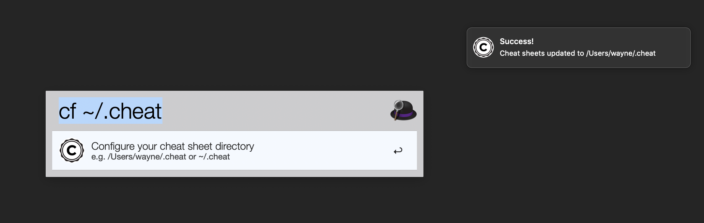
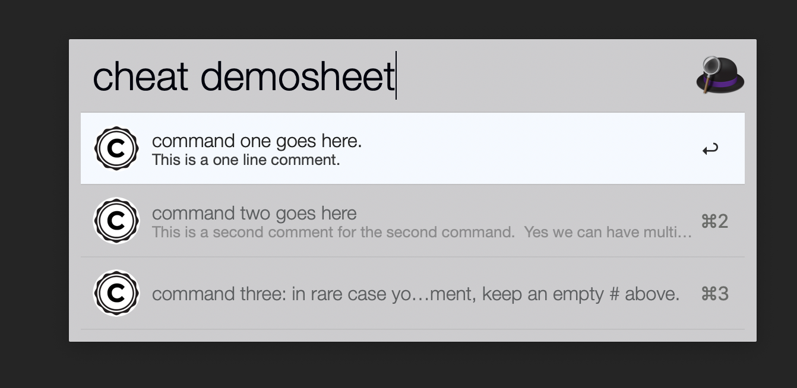

# Alfred-cheat 

**Start writing your very own cheat sheets in your way and make them searchable using Alfred!**

# Demo

*Every sheet shown in the demo should be your knowledge base and is totally customizable.*


# About & Acknowledgement

This project was initally inspired by [cheat](https://github.com/cheat/cheat). I attempted to wrap around it but failed because that project wasn't intended to be wrapped around. So this project ended up a separate one. These two projects serve similar purpose in different working environments. With the help of alfred, your efficiency in searching your cheat sheets will be significantly boosted. And the better news is, you're in complete control of your cheat sheets unlike [tldr](https://github.com/tldr-pages/tldr) (It's good though if you want it "just work").

I built this workflow because:

1. I want faster searching than the original [cheat](https://github.com/cheat/cheat) because that project is commandline based. Sometimes I want a very quick view and don't wanna popup a shell.

2. I want to build my own knowledge base instead of community-driven cheat sheets like [tldr](https://github.com/tldr-pages/tldr) does.

# Download via [release](https://github.com/wx-Yao/alfred-cheat/releases)

# How it works

1. You define a directory to store your cheat sheets, which are essentially text files. And name the file the command your wanna record. e.g, `nmap`, `top`, `tar` etc. (tips: you can start with the cheat sheets provided by [cheat](https://github.com/cheat/cheat))

2. You write your cheat sheet according to the  (very intuitive and tolerant) bit by bit.

3. Tell the workflow where that directory is and start searching.

# Usage

First, you need to specify your sheet directory like this. Otherwise, it doesn't work. Both absolute or relative path will work.



Then, you're good to go.

- To list all your cheat: `cheat`

- To search and list the content of one of your cheat: `cheat <sheet name>`. Fuzzy search and autocomplete is supported.

- To search in a specific sheet indexed by some keyword: `cheat <sheet name> <keyword>`.

- To search across all your sheets for some keyword: `cheat --search <keyword>`

# Parsing rule

It's not even a rule... You just need to remember two things when writing your cheat sheet:

1. Comment first, then the command.

2. Separate each `comment, command` pair with 2 newlines. (one newline visually)

That's it.

e.g. this cheat sheet is called `demosheet`. Its content is the following:

```
# This is a one line comment. 
command one goes here.

# This is a second comment for the second command
# Yes we can have multiple line comment.
# But remember only the last line will be considered "command".
command two goes here

#
command three: in rare cases you don't have any comment, keep an empty # above.

# Any failed parsing will be ignored, like this line because it isn't associated with a command

or this line because it's a single line.
```

The above sheet will be parsed like this:



# Compatibility

This workflow works out of the box (zero dependencies). It's tested on **macOS 10.14.5 Mojave** with **Alfred 4**. You need the [powerpack](https://www.alfredapp.com/shop/) to get it working. I believe it works with Alfred3 on any macOS after 10.10 Yosemite but that hasn't been tested. Report an issue if there's a problem.

# Contribution

Any idea of improvement will be welcomed. But I don't wanna add the feature of modifying cheat sheet right in Alfred because it's what it supposed to do. Use vim or other editors you like.
